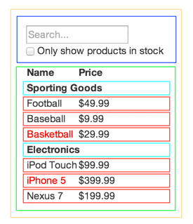

# React로 사고하기

- React는 JavaScript로 규모가 크고 빠른 웹 애플리케이션을 만드는 방법
- React의 가장 멋진 점 중 하나는 앱을 설계하는 방식
- React로 상품들을 검색할 수 있는 데이터 테이블을 만드는 과정


## 목업으로 시작하기

- JSON API와 목업을 디자이너로부터 받았다고 가정

  

- JSON API는 아래와 같은 데이터를 반환

  ```json
  [
    {category: "Sporting Goods", price: "$49.99", stocked: true, name: "Football"},
    {category: "Sporting Goods", price: "$9.99", stocked: true, name: "Baseball"},
    {category: "Sporting Goods", price: "$29.99", stocked: false, name: "Basketball"},
    {category: "Electronics", price: "$99.99", stocked: true, name: "iPod Touch"},
    {category: "Electronics", price: "$399.99", stocked: false, name: "iPhone 5"},
    {category: "Electronics", price: "$199.99", stocked: true, name: "Nexus 7"}
  ];
  ```


## 1단계: UI를 컴포넌트 계층 구조로 나누기

- 첫 번째 일은 모든 컴포넌트의 주변에 박스를 그리고 각각에 이름을 붙이는 것

- 어떤 것이 컴포넌트가 되어야 할지 어떻게 알까

  - 새로운 함수나 객체를 만들 때처럼 만들면 됨
  - 한 가지 테크닉은 단일 책임 원칙
    - 하나의 컴포넌트는 한 가지 일을 하는게 이상적이라는 원칙

- 다섯개의 컴포넌트로 분류

  

- 계층 구조로 나열
  - FilterableProductTable(Yellow)
    - SearchBar(Blue)
    - ProductTable(Green)
      - ProductCategoryRow(turquoise)
      - ProductRow(Red)


## 2단계: React로 정적인 버전 만들기

- 컴포넌트 계층구조를 이용해 앱을 실제로 구현
- 아무 동작 없는 UI만 렌더링하는 버전
- 데이터 모델을 렌더링하는 앱의 정적 버전 만들기위해
  - 다른 컴포넌트를 재사용하는 컴포넌트 만들기
  - props를 이용해 데이터를 전달
  - props는 부모가 자식에게 데이터를 넘겨줄 때 사용할 수 있는 방법
- 정적 버전을 만들 때는 state를 사용하지 않음
  - state는 오직 상호작용을 위해, 시간이 지남에 따라 데이터가 바뀌는 것에 사용
- 앱을 만들 때 하향식(top-down)이나 상향식(bottom-up)으로 만들 수 있음
  - 구조의 상층부에 있는 컴포넌트(FilterableProductTable)부터 만들거나
  - 하층부에 있는 컴포넌트(ProductRow)부터 만들 수 있음
- 앱의 정적 버전이기 때문에 컴포넌트는 render() 메서드만 가지고 있음
- 최상단 컴포넌트는 prop로 데이터 모델을 받음


## 3단계: UI state에 대한 최소한의 (하지만 완전한) 표현 찾아내기

- UI를 상호작용하게 만들려면 기반 데이터 모델을 변경할 수 있는 방법이 있어야 한다.
  - 이를 React는 state를 통해 변경
- 애플리케이션을 올바르게 만들기 위해서는 애플리케이션에서 필요로 하는 변경 가능한 state의 최소 집합을 생각해야 함
- 예시 애플리케이션은 다음과 같은 데이터를 가짐
  - 제품의 원본 목록
  - 유저가 입력한 검색어
  - 체크박스의 값
  - 필터링 된 제품들의 목록
- 어떤게 state가 되어야 하는지 세 가지 질문을 통해 결정
  1. 부모로부터 props를 통해 전달됩니까? 그렇다면 state 아님
  2. 시간이 지나도 변하지 않나요? 그렇다면 state 아님
  3. 컴포넌트 안의 다른 state나 props를 가지고 계산 가능한가요? 그렇다면 state ㅏ님
- 애플리케이션은 다음과 같은 state를 가짐
  - 유저가 입력한 검색어
  - 체크박스의 값


## 4단계: State가 어디에 있어야 할 지 찾기

- 어떤 컴포넌트가 state를 변경하거나 소유할지 찾기
- React는 항상 컴포넌트 계층구조를 따라 아래로 내려가는 **단방향 데이터 흐름**
- 애플리케이션이 가지는 각각의 state에 대해서
  - state를 기반으로 렌더링하는 모든 컴포넌트 찾기
  - 공통 소유 컴포넌트(common owner component)를 찾기
    - 계층 구조 내에서 특정 state가 있어야 하는 모든 컴포넌트들의 상위에 있는 하나의 컴포넌트
  - 공통 혹은 더 상위에 있는 컴포넌트가 state를 가져야 함
  - state를 소유할 적절한 컴포넌트를 찾지 못한다면
    - state를 소유하는 컴포넌트를 하나 만들어서 공통 오너 컴포넌트의 상위 계층에 추가
- 이 전략을 애플리케이션에 적용
  - ProductTable은 state에 의존한 상품 리스트의 필터링해야 하고 SearchBar는 검색어와 체크박스의 상태를 표시해주어야 함
  - 공통 소유 컴포넌트는 FilterableProductTable
  - FilterableProductTable이 검색어와 체크박스의 체크 여부를 가지는 것이 타당


## 5단계: 역방향 데이터 흐름 추가하기

- 계층 구조의 하단에 있는 폼 컴포넌트에서 FilterableProductTable의 state를 업데이트할 수 있어야 함
- 현재 상태에서 input box를 체크하거나 키보드를 타이핑하면
  - React가 입력을 무시함
- 이는 input태그의 value속성이 항상 FilterableProductTable에서 전달된 state와 동일하도록 설정했기 때문
- 사용자가 폼을 변경할 때마다 사용자의 입력을 반영할 수 있도록 state를 업데이트하기를 원함
  - FilterableProductTable는 SearchBar에 콜백을 넘겨서 state가 업데이트되어야 할 때마다 호출되도록 함
  - input에 onChange 이벤트를 사용해서 알림을 받을 수 있음
  - FilterableProductTable에서 전달된 콜백은 setState()를 호출하고 앱이 업데이트


#### Reference

- 예시 애플리케이션에 대한 코드와 더 많은 내용
- https://ko.reactjs.org/docs/thinking-in-react.html

